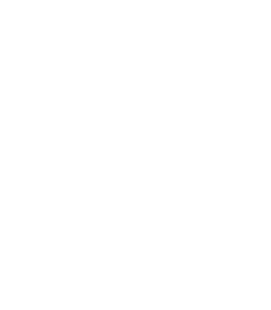
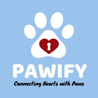
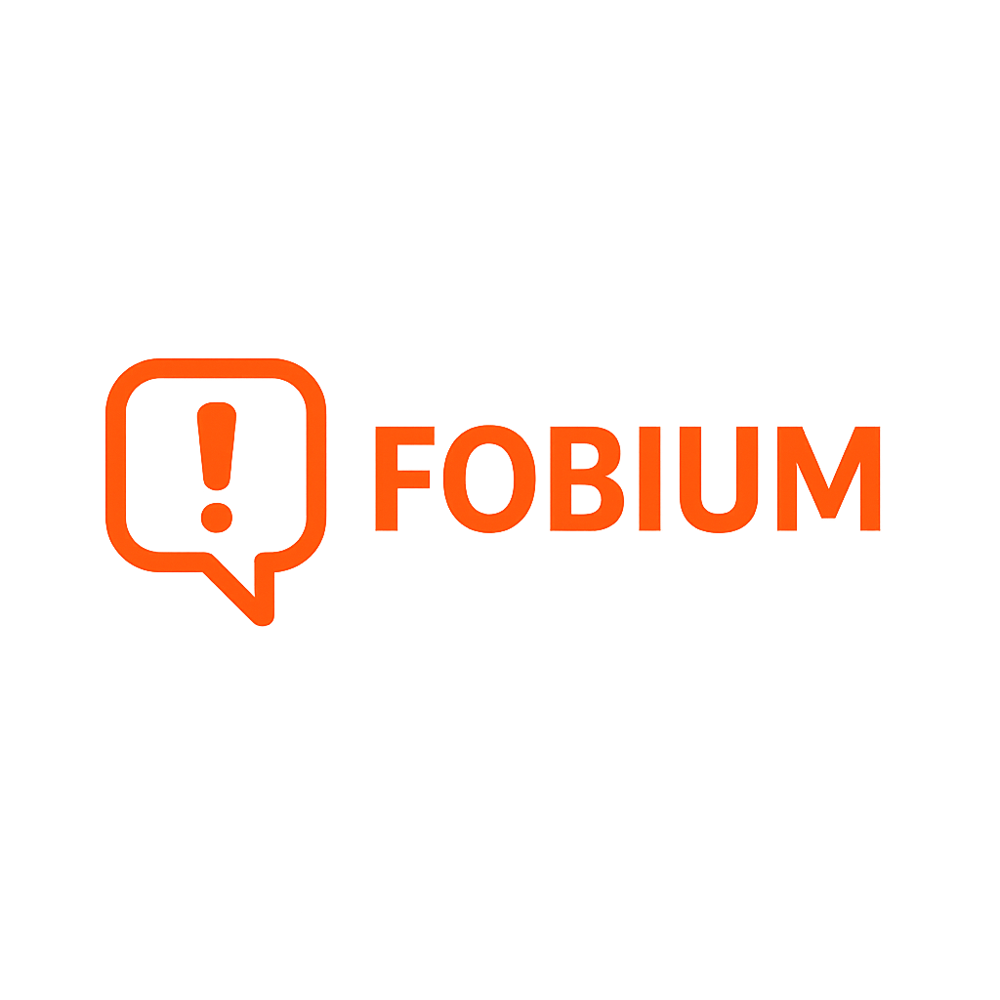

 

 

**Who Am I?**

I'm Lia, a `Computer Engineering student at FIUBA` passionate about technology, games, and innovation. I started in `software development` but found my place in game development and artificial intelligence, where I combine creativity with logic to build meaningful projects.

I work with `Unity, Roblox, and backend technologies`, always exploring new tools to improve my craft. For me, coding is more than solving problems — it’s about creating interactive experiences and bringing ideas to life.

Beyond code, I thrive on curiosity and challenges, turning abstract concepts into real-world solutions.

 

 

 <h3 align="center">
  
  A Little More About Me 
  
 </h3>

 ⬛ Passionate about game development, AI, and creating interactive experiences 
 ⬜ Always eager to learn new tools and improve my craft   
 ⬛ Enjoy mentoring, teaching, and collaborating on projects  
 ⬜ Curious, creative, and always looking for challenges that combine logic and imagination  

  
 

  
  
  

 

<h3 align="center">
 
 My Tech Stack
 
</h3>
 

  
   
  
   
  
   
  

 

  
<b>Featured Projects</b>

  <table>
    <tr>
      <td width="50%">
        <h3 align="center">Margarita Tycoon</h3>
        

          
           
           
          

            
            
          

          
<strong>Collection of game projects</strong> - A Roblox tycoon game where I contributed to gameplay design and feature implementation, showcasing creativity and technical skills with Lua scripting in Roblox Studio.

        

      </td>
      <td width="50%">
        <h3 align="center">Dizang: Through the nine hells</h3>
        

          
           
           
          

            
            
          

          
<strong>Mobile applications</strong> - A collaborative Unity project developed during a Game Jam. Focused on narrative-driven gameplay and atmospheric design, built with C# under time constraints, showcasing teamwork and creativity.

        

      </td>
    </tr>
    <tr>
      <td width="50%">
        <h3 align="center">Pawify - Connecting Hearts wit Paws</h3>
        

          
           
           
          

            
            
          

          
<strong>Automation & AI tools</strong> - A mobile app prototype focused on pet adoption and care services. Implemented web scraping to collect and centralize data from multiple sources, combining backend development with a user-friendly interface to create a practical and impactful tool.

        

      </td>
      <td width="50%">
        <h3 align="center">Fobium</h3>
        

          
           
           
          

            
            
            
          

          
<strong>Web applications</strong> – A web platform prototype designed to deliver immersive horror-themed experiences. Developed with a focus on web technologies, atmosphere, and interactivity, combining design and programming to create a unique digital concept.

        

      </td>
    </tr>
  </table>

  

